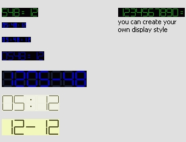



## Costumizable LCD display

### Description

i created this for my skinnable mp3 player.You can create your own display style very fast with a size as you want.All you need is to set

the width and height of the number.The code is very small and it's easy to understand.Please vote if you find this usefull.sorry for my english.. :)
 
### More Info
 

             |
---                |---
**Submitted On**   |2006-02-01 05:53:36
**By**             |[Moisii Norbert](https://github.com/Planet-Source-Code/PSCIndex/blob/master/ByAuthor/moisii-norbert.md)
**Level**          |Intermediate
**User Rating**    |4.3 (13 globes from 3 users)
**Compatibility**  |VB 5\.0, VB 6\.0
**Category**       |[Custom Controls/ Forms/  Menus](https://github.com/Planet-Source-Code/PSCIndex/blob/master/ByCategory/custom-controls-forms-menus__1-4.md)
**World**          |[Visual Basic](https://github.com/Planet-Source-Code/PSCIndex/blob/master/ByWorld/visual-basic.md)
**Archive File**   |[Costumizab197785342006\.zip](https://github.com/Planet-Source-Code/moisii-norbert-costumizable-lcd-display__1-64531/archive/master.zip)

